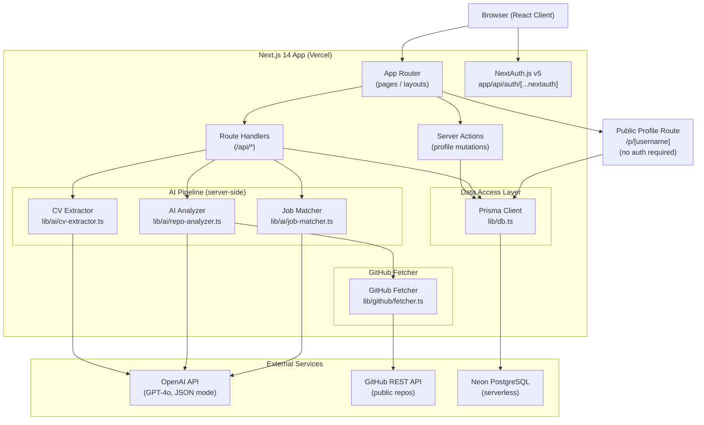

# Design Document: Verifolio MVP

## Overview

Verifolio is a full-stack web application that lets students and early-career developers build an evidence-backed technical portfolio. It parses a CV to bootstrap a structured profile, analyzes public GitHub repositories with GPT-4o to discover verified skills and code evidence, detects weak claims (CV skills with no code proof), matches the evidence-backed profile against a pasted job description, and exposes a shareable public profile URL.

The MVP is designed for a solo developer to ship in 2–3 days. All infrastructure complexity is pushed to managed services (Vercel, Neon serverless Postgres), and all AI features are delegated to the OpenAI API (GPT-4o). There is no background job queue; all AI calls are made synchronously from Next.js Route Handlers with simple loading states. GitHub OAuth, private repositories, recruiter accounts, and marketplace features are explicitly out of scope.

**Technology Stack**

| Concern | Choice | Rationale |
|---|---|---|
| Full-stack framework | Next.js 14 (App Router) | Server Components, Route Handlers, and Server Actions in one project; zero-config Vercel deploy |
| Database | PostgreSQL via Neon (serverless) | Scales to zero; free tier; integrates with Prisma |
| ORM | Prisma | Type-safe schema-first ORM; migrations in seconds |
| Authentication | NextAuth.js v5 (Auth.js) – Credentials provider | Email + password auth; session cookies; minimal setup |
| AI | OpenAI API – GPT-4o | All three AI features (CV extraction, repo analysis, JD matching) use a single GPT-4o JSON-mode call each |
| CV parsing | `pdf-parse` (PDF) + built-in `fs.readFile` (TXT) | Text extraction before sending to GPT-4o |
| GitHub data | GitHub REST API (unauthenticated) | No auth token required. Max 2–3 repos per user; fetcher samples ≤ 15 files per repo (README + root-level source files). Total GitHub API cost per repo: ~2–17 requests, well within the 60 req/hr unauthenticated limit. |
| UI components | Tailwind CSS + shadcn/ui | Accessible, pre-built components; zero design time |
| Deployment | Vercel (app) + Neon (database) | One-command deploy |

---

## Architecture

### High-Level Component Diagram



### Request Flow Summary

1. **CV Upload**: Browser POSTs multipart form → `POST /api/cv/upload` Route Handler → `pdf-parse` / text read → GPT-4o CV extraction prompt → structured JSON → upsert Profile in DB → return profile JSON to client.
2. **Repo Analysis**: Browser POSTs repo URL → `POST /api/repos/analyze` Route Handler → GitHub Fetcher fetches tree + sampled file contents → GPT-4o analyzer prompt → structured JSON (skills, evidence items, weak claims) → persist to DB → return to client.
3. **JD Match**: Browser POSTs JD text → `POST /api/jobs/match` Route Handler → load candidate skills from DB → GPT-4o matcher prompt → structured JSON (match results) → persist JobMatch to DB → return to client.
4. **Public Profile**: GET `/p/[username]` → Server Component queries DB → renders read-only profile (no auth check).
5. **Profile Edits**: Server Actions called from React forms → validate → `prisma.profile.update` → revalidate page.

---

## Components and Interfaces

### 1. CV Extractor (`lib/ai/cv-extractor.ts`)

**Responsibility**: Accept raw CV text (extracted from PDF or TXT), call GPT-4o with a structured prompt, and return a validated `ExtractedProfile` object.

**Input**: `cvText: string` (raw text, max ~20KB before truncation)

**Output**:
```typescript
interface ExtractedProfile {
  name: string;
  education: EducationEntry[];
  workExperience: WorkEntry[];
  declaredSkills: string[];
  extractionWarnings: string[]; // sections that could not be parsed
}

interface EducationEntry {
  institution: string;
  degree: string;
  field: string;
  graduationYear: string;
}

interface WorkEntry {
  company: string;
  title: string;
  startDate: string;
  endDate: string;
  description: string;
}
```

**Design decision**: GPT-4o is called with `response_format: { type: "json_object" }` and a system prompt that specifies the exact JSON schema. The model is instructed to set fields to `null` or empty array (not omit them) when data is missing, so the consumer always gets a structurally consistent object. Missing sections are surfaced via `extractionWarnings`.

---

### 2. GitHub Fetcher (`lib/github/fetcher.ts`)

**Responsibility**: Given a public GitHub repository URL, fetch a small representative sample of source files to pass to the AI Analyzer. No authentication token required.

**Strategy**:
1. Parse the URL to extract `{owner}/{repo}`.
2. Call `GET /repos/{owner}/{repo}` to verify the repo is accessible and retrieve the default branch name.
3. Call `GET /repos/{owner}/{repo}/git/trees/{sha}?recursive=1` to get the full file tree (1 API call regardless of repo size).
4. Filter to source files only — exclude `node_modules`, `.git`, lock files, images, and binaries — using an extension allow-list: `.ts`, `.tsx`, `.js`, `.jsx`, `.py`, `.go`, `.java`, `.rs`, `.rb`, `.cs`, `.cpp`, `.c`, `.md`.
5. Select up to **15 files** by priority: `README.md` first, then root-level source files, then files with names containing `index`, `main`, `app`, `server`, `routes`, `models`, or `schema`.
6. Fetch each selected file via `GET /repos/{owner}/{repo}/contents/{path}`. Truncate each file to **2 KB**. Total payload cap: **~30 KB per repo**.

**Rate limit math**: 1 (repo info) + 1 (tree) + up to 15 (file contents) = **≤ 17 requests per repo**. With a 3-repo max: ≤ 51 requests per user session, safely within the 60 req/hr unauthenticated limit. No GITHUB_TOKEN needed.

**Output**:
```typescript
interface RepoSample {
  repoUrl: string;
  ownerRepo: string;
  defaultBranch: string;
  fileCount: number; // total files in tree (for context)
  sampledFiles: SampledFile[];
}

interface SampledFile {
  path: string;
  content: string; // truncated to 2KB
}
```

---

### 3. AI Analyzer (`lib/ai/repo-analyzer.ts`)

**Responsibility**: Accept a `RepoSample`, call GPT-4o with an analysis prompt, and return a validated `AnalysisResult`.

**Input**: `RepoSample`

**Output**:
```typescript
interface AnalysisResult {
  skills: AnalyzedSkill[];
}

interface AnalyzedSkill {
  name: string;
  strength: "Strong" | "Partial" | "Inferred";
  evidenceItems: EvidenceItemData[];
  dimensions: SkillDimension[];
}

type SkillDimension =
  | "programming_language"
  | "framework_library"
  | "architectural_pattern"
  | "testing_practice"
  | "tooling";

interface EvidenceItemData {
  repoName: string;
  filePath: string;
  description: string; // one sentence
}
```

**Strength assignment rules** (enforced in prompt + post-processing validation):
- `"Strong"`: 3 or more substantive `evidenceItems`
- `"Partial"`: 1 or 2 `evidenceItems`
- `"Inferred"`: skill implied by project context, no direct code artifact (`evidenceItems` may be empty or contain one context-level item)

---

### 4. Job Matcher (`lib/ai/job-matcher.ts`)

**Responsibility**: Accept JD text and a candidate's confirmed skill set, call GPT-4o, and return categorized `MatchResult[]`.

**Input**:
```typescript
interface JobMatchInput {
  jdText: string;
  candidateSkills: CandidateSkillSummary[];
}

interface CandidateSkillSummary {
  name: string;
  strength: "Strong" | "Partial" | "Inferred";
  evidenceSummary: string; // e.g., "3 evidence items across 2 repos"
}
```

**Output**:
```typescript
interface JobMatchOutput {
  extractedRequiredSkills: string[];
  extractedPreferredSkills: string[];
  matchResults: MatchResult[];
}

interface MatchResult {
  skillName: string;
  category: "StrongMatch" | "PartialMatch" | "Gap";
  matchedCandidateSkillName: string | null;
  gapGuidance: string | null; // only populated for Gap
}
```

---

### 5. Authentication (`app/api/auth/[...nextauth]/route.ts`)

- NextAuth.js v5 with Credentials provider.
- `signIn` callback validates email + bcrypt password against the `User` table.
- Session strategy: JWT cookies (no database sessions needed for MVP).
- Password hashing: `bcryptjs` (10 rounds).
- Protected routes: Next.js middleware checks session for all `/dashboard/*` and `/api/*` routes (except `/api/auth/*` and `/p/*`).

---

### 6. Public Profile (`app/p/[username]/page.tsx`)

- Server Component, no auth check.
- Queries `User` by `username` (slug derived from name at registration, e.g., `hadia-khan-abc123`).
- Renders confirmed skills with `isPublic: true`, grouped by strength.
- Does **not** expose email, education, or work experience.
- Revalidation: Next.js `revalidateTag` or simple `no-store` fetch ensures data is fresh on each page load.

---

## Data Models

### Prisma Schema

```prisma
// prisma/schema.prisma

generator client {
  provider = "prisma-client-js"
}

datasource db {
  provider = "postgresql"
  url      = env("DATABASE_URL")
}

model User {
  id            String    @id @default(cuid())
  email         String    @unique
  passwordHash  String
  username      String    @unique  // public profile slug, e.g. "hadia-khan-a3f2"
  createdAt     DateTime  @default(now())
  updatedAt     DateTime  @updatedAt

  profile       Profile?
  repositories  Repository[]
}

model Profile {
  id              String    @id @default(cuid())
  userId          String    @unique
  user            User      @relation(fields: [userId], references: [id], onDelete: Cascade)

  // CV-extracted fields
  displayName     String    @default("")
  education       Json      @default("[]")   // EducationEntry[]
  workExperience  Json      @default("[]")   // WorkEntry[]
  cvUploadedAt    DateTime?

  // All skills (declared + discovered + confirmed)
  skills          Skill[]

  createdAt       DateTime  @default(now())
  updatedAt       DateTime  @updatedAt
}

model Skill {
  id            String      @id @default(cuid())
  profileId     String
  profile       Profile     @relation(fields: [profileId], references: [id], onDelete: Cascade)

  name          String
  // Origin: how this skill entered the profile
  origin        SkillOrigin
  // State: lifecycle state of the skill
  state         SkillState  @default(Pending)
  // Strength: computed from evidence item count
  strength      SkillStrength?

  isPublic      Boolean     @default(true)  // toggleable on public profile

  evidenceItems EvidenceItem[]

  createdAt     DateTime    @default(now())
  updatedAt     DateTime    @updatedAt

  @@unique([profileId, name])
}

enum SkillOrigin {
  Declared    // from CV
  Discovered  // found by AI Analyzer, not on CV
}

enum SkillState {
  Pending     // Discovered but not yet accepted/dismissed by candidate
  Confirmed   // Accepted (or was Declared)
  Dismissed   // Rejected by candidate
  WeakClaim   // Declared but no evidence found
}

enum SkillStrength {
  Strong
  Partial
  Inferred
}

model EvidenceItem {
  id            String   @id @default(cuid())
  skillId       String
  skill         Skill    @relation(fields: [skillId], references: [id], onDelete: Cascade)
  repositoryId  String
  repository    Repository @relation(fields: [repositoryId], references: [id], onDelete: Cascade)

  filePath      String
  description   String   // one-sentence AI-generated description

  createdAt     DateTime @default(now())
}

model Repository {
  id              String    @id @default(cuid())
  userId          String
  user            User      @relation(fields: [userId], references: [id], onDelete: Cascade)

  url             String
  ownerRepo       String    // "owner/repo" normalized form
  defaultBranch   String    @default("main")
  analyzedAt      DateTime?
  analysisStatus  RepoStatus @default(Pending)
  errorMessage    String?

  evidenceItems   EvidenceItem[]

  createdAt       DateTime  @default(now())
  updatedAt       DateTime  @updatedAt

  @@unique([userId, ownerRepo])
  // MVP: max 3 repositories per user enforced at application layer
}

enum RepoStatus {
  Pending
  Analyzing
  Done
  Error
}

model JobMatch {
  id              String        @id @default(cuid())
  userId          String
  user            User          @relation(fields: [userId], references: [id], onDelete: Cascade)

  jdText          String        @db.Text
  extractedSkills Json          @default("[]")  // string[] of skills extracted from JD
  matchResults    MatchResult[]

  createdAt       DateTime      @default(now())
}

model MatchResult {
  id                      String       @id @default(cuid())
  jobMatchId              String
  jobMatch                JobMatch     @relation(fields: [jobMatchId], references: [id], onDelete: Cascade)

  skillName               String
  category                MatchCategory
  matchedCandidateSkill   String?      // name of matched skill, if any
  gapGuidance             String?      // only for Gap category
}

enum MatchCategory {
  StrongMatch
  PartialMatch
  Gap
}
```

### Key Design Decisions

- **`Skill.state` enum** cleanly models the lifecycle: Declared skills start as `Confirmed`; Discovered skills start as `Pending`; after analysis, any Declared skill with zero evidence items is transitioned to `WeakClaim`.
- **`education` and `workExperience` are stored as JSON** to avoid over-normalizing a schema that won't be queried by sub-fields in the MVP.
- **`username` slug** is generated at registration as `{normalized-name}-{4-char-random}`, guaranteeing uniqueness without complex retry logic.
- **`EvidenceItem` links to both `Skill` and `Repository`** to support efficient queries like "all evidence for skill X across all repos" or "all skills found in repo Y".
- **Repository cap of 3** is enforced in the API route before calling the fetcher, returning a 400 error if the user already has 3 repositories. This keeps unauthenticated GitHub API usage within safe limits without any token.
- **No GitHub authentication token required.** The 3-repository cap combined with the ≤15-file sampling strategy keeps total GitHub API requests per session under 60, fitting within the unauthenticated rate limit.

---

## AI Pipeline Design

### Prompts Strategy

All AI calls use GPT-4o with `response_format: { type: "json_object" }`. Each prompt consists of:
1. A **system prompt** that describes the role, the exact JSON schema expected in the response, and behavioral constraints.
2. A **user prompt** that contains the candidate's data.

The system prompt includes the target JSON schema inline as a TypeScript interface comment, so the model can self-validate its output.

---

### AI Call 1: CV Extractor

**Endpoint**: `POST /api/cv/upload`

**System prompt** (abbreviated):
```
You are a CV parser. Extract structured data from the provided CV text.
Respond ONLY with a JSON object matching this exact schema:
{
  "name": string,
  "education": [{ "institution": string, "degree": string, "field": string, "graduationYear": string }],
  "workExperience": [{ "company": string, "title": string, "startDate": string, "endDate": string, "description": string }],
  "declaredSkills": string[],
  "extractionWarnings": string[]
}
Use empty strings or empty arrays for missing data. Never omit fields.
Add a warning to extractionWarnings for any section that could not be confidently parsed.
```

**User prompt**: Raw CV text (truncated to 15,000 tokens if necessary)

**Post-processing**: Validate that all required top-level fields are present; if any are missing, add a generic extraction warning and default to empty values.

---

### AI Call 2: Repository Analyzer

**Endpoint**: `POST /api/repos/analyze`

**System prompt** (abbreviated):
```
You are a code skills analyzer. Given a sample of source files from a GitHub repository,
identify all technical skills demonstrated.

Classify each skill into one of these dimensions: programming_language, framework_library,
architectural_pattern, testing_practice, tooling.

Assign Skill Strength:
- "Strong": 3 or more specific code artifacts support the skill
- "Partial": 1 or 2 code artifacts
- "Inferred": skill is implied by project structure/config but no direct code pattern observed

For each evidence item, provide: filePath (relative to repo root), description (one sentence
describing the specific code pattern observed).

Respond ONLY with:
{
  "skills": [{
    "name": string,
    "strength": "Strong" | "Partial" | "Inferred",
    "dimensions": string[],
    "evidenceItems": [{ "filePath": string, "description": string }]
  }]
}
```

**User prompt**:
```
Repository: {ownerRepo}
Files sampled: {fileCount} of {totalFiles} total

{for each file: "--- {path} ---\n{content}\n"}
```

**Post-processing**:
1. Validate JSON schema.
2. Cross-check: any skill with `"Strong"` strength must have `evidenceItems.length >= 3`; downgrade to `"Partial"` if not.
3. Cross-check: any skill with `"Partial"` strength must have `evidenceItems.length >= 1`; downgrade to `"Inferred"` if not.
4. Enforce: any `Discovered` skill (not in candidate's declared skills) must have at least one evidence item; if `evidenceItems` is empty for an `Inferred` skill, persist the skill without evidence items — the inference is based on project metadata (e.g., a dependency in `package.json`), not a specific file.

---

### AI Call 3: Job Matcher

**Endpoint**: `POST /api/jobs/match`

**System prompt** (abbreviated):
```
You are a job-skills matcher. Compare a candidate's verified skills against a job description.

For each required skill mentioned in the JD, classify it as:
- "StrongMatch": candidate has this skill with "Strong" evidence
- "PartialMatch": candidate has this skill with "Partial" or "Inferred" evidence
- "Gap": candidate has no evidence for this skill

For Gap skills, provide a brief gapGuidance string (one sentence describing what project work
or code artifact would close the gap).

Respond ONLY with:
{
  "extractedRequiredSkills": string[],
  "extractedPreferredSkills": string[],
  "matchResults": [{
    "skillName": string,
    "category": "StrongMatch" | "PartialMatch" | "Gap",
    "matchedCandidateSkillName": string | null,
    "gapGuidance": string | null
  }]
}
```

**User prompt**:
```
Job Description:
{jdText}

Candidate Verified Skills:
{candidateSkills as JSON array}
```

**Post-processing**:
1. Validate JSON schema.
2. Verify every skill in `extractedRequiredSkills` appears in `matchResults`; add Gap entries for any omitted.
3. Verify `matchResults` counts: `strongMatches + partialMatches + gaps === extractedRequiredSkills.length`.

---

## Key UI Pages and Components

### Page Map

```
app/
├── (auth)/
│   ├── login/page.tsx          — email/password login form
│   └── register/page.tsx       — registration form
├── dashboard/
│   ├── page.tsx                — profile overview, CV upload CTA
│   ├── profile/page.tsx        — editable profile fields
│   ├── repos/page.tsx          — repo URL list, analysis trigger, skill cards
│   ├── skills/page.tsx         — all skills: confirmed, discovered (pending), weak claims
│   ├── evidence/[skillId]/page.tsx — evidence report for one skill
│   └── jobs/page.tsx           — JD paste + match results
└── p/
    └── [username]/page.tsx     — public shareable profile (no auth)
```

### Key Components

| Component | Location | Description |
|---|---|---|
| `CVUploadCard` | `components/cv/CVUploadCard.tsx` | Drag-and-drop or click to upload PDF/TXT; shows extraction status |
| `RepoInputList` | `components/repos/RepoInputList.tsx` | Up to 5 URL inputs; per-repo status badge (Pending / Analyzing / Done / Error) |
| `SkillCard` | `components/skills/SkillCard.tsx` | Displays skill name, strength badge, origin tag (Declared / Discovered), and action buttons (accept/dismiss for Discovered) |
| `WeakClaimBanner` | `components/skills/WeakClaimBanner.tsx` | Warning list of Declared skills with no code evidence |
| `EvidenceReport` | `components/evidence/EvidenceReport.tsx` | Skill name + strength + list of evidence items with repo/path/description |
| `JobMatchResults` | `components/jobs/JobMatchResults.tsx` | Three-column layout: Strong Match / Partial Match / Gap; summary counts header |
| `PublicProfileView` | `components/public/PublicProfileView.tsx` | Read-only; skills grouped by strength; evidence summaries |

### Data Flow Pattern

- **Dashboard pages** are Server Components that fetch data server-side via Prisma, passing serialized props to Client Components for interactivity.
- **Mutations** (profile edits, skill accept/dismiss, visibility toggle) use Server Actions with `revalidatePath` to keep UI in sync.
- **Long-running AI calls** (CV upload, repo analysis, JD match) use Route Handlers. The client shows a loading spinner while polling or awaiting the response. Given the MVP scope, optimistic UI is not implemented; a simple loading state is sufficient.

---

## Correctness Properties

*A property is a characteristic or behavior that should hold true across all valid executions of a system — essentially, a formal statement about what the system should do. Properties serve as the bridge between human-readable specifications and machine-verifiable correctness guarantees.*

### Property 1: Password Minimum-Length Validation

*For any* string of length less than 8 characters, the registration validation function SHALL reject it as an invalid password. *For any* string of length 8 or more characters, it SHALL accept it.

**Validates: Requirements 1.1**

---

### Property 2: Authentication Round-Trip Correctness

*For any* valid email address and password pair used to register a new account, submitting that same email and password to the login endpoint SHALL return an authenticated session. *For any* registered user, submitting an incorrect password SHALL always return an authentication failure and SHALL NOT return a session token.

**Validates: Requirements 1.3, 1.4**

---

### Property 3: CV File-Type Validation

*For any* MIME type that is exactly `application/pdf` or `text/plain`, the upload validation function SHALL accept the file. *For any* MIME type that is neither of those two values, the validation function SHALL reject the file and return an error identifying the accepted types.

**Validates: Requirements 2.1, 2.2**

---

### Property 4: CV Extractor Output Schema Completeness

*For any* non-empty CV text input passed to the CV Extractor, the returned JSON object SHALL always contain the fields `name`, `education`, `workExperience`, `declaredSkills`, and `extractionWarnings` at the top level. None of these fields SHALL be absent, even if their values are empty strings or empty arrays.

**Validates: Requirements 2.3, 2.4**

---

### Property 5: CV Re-Upload Replaces Profile

*For any* two sequential CV uploads by the same candidate, the candidate's profile after the second upload SHALL contain only the data extracted from the second CV. No field from the first CV SHALL persist in the profile after the second upload completes successfully.

**Validates: Requirements 2.6**

---

### Property 6: Repository Count Bounds

*For any* integer `n`, a candidate attempting to add `n` repository URLs SHALL succeed if and only if `1 ≤ n ≤ 3`. Any attempt to add a 4th repository to a profile that already has 3 SHALL be rejected with an error. Adding 0 repositories (empty list) SHALL NOT trigger an analysis.

**Validates: Requirements 3.1**

---

### Property 7: AI Analyzer Output Schema Invariant

*For any* `RepoSample` input to the AI Analyzer, the parsed response SHALL always conform to the schema: a `skills` array where every element has a non-empty `name` string, a `strength` value that is exactly one of `"Strong"`, `"Partial"`, or `"Inferred"`, a `dimensions` array with at least one entry, and an `evidenceItems` array (which may be empty only for `"Inferred"` skills).

**Validates: Requirements 3.3, 3.5**

---

### Property 8: Discovered Skill Classification

*For any* AI Analyzer output, a skill whose `name` does not appear in the candidate's `declaredSkills` set SHALL be created in the database with `origin = Discovered` and `state = Pending`. A skill whose `name` does appear in the candidate's `declaredSkills` set SHALL be matched to the existing Declared skill and its evidence items added — it SHALL NOT be duplicated as a Discovered skill.

**Validates: Requirements 4.1**

---

### Property 9: Weak Claim Detection

*For any* candidate profile after at least one repository analysis has completed, every skill with `origin = Declared` and zero associated `EvidenceItem` records SHALL be assigned `state = WeakClaim`. No skill with one or more `EvidenceItem` records SHALL be assigned `state = WeakClaim`.

**Validates: Requirements 4.4**

---

### Property 10: Evidence Item Cardinality for Discovered Skills

*For any* AI Analyzer output, every skill classified as `Discovered` (i.e., not in the candidate's declared skills) SHALL have at least one `EvidenceItem` persisted in the database. A Discovered skill with zero evidence items SHALL NOT be persisted.

**Validates: Requirements 4.5**

---

### Property 11: Evidence Report Structural Completeness

*For any* `Skill` record in the database that has `evidenceItems.length ≥ 1`, querying the evidence report for that skill SHALL return an object containing: the `skillName`, the `strength`, and for each evidence item: `repoName`, `filePath`, and `description`. No required field SHALL be absent or null in the response.

**Validates: Requirements 5.1, 5.2**

---

### Property 12: Skill Strength Assignment Rules

*For any* skill where the number of non-inferred `evidenceItems` is 3 or more, the assigned `strength` SHALL be `"Strong"`. *For any* skill where that count is exactly 1 or 2, the `strength` SHALL be `"Partial"`. *For any* skill identified purely by project context with no direct code artifact, the `strength` SHALL be `"Inferred"`. No other strength values SHALL be assigned.

**Validates: Requirements 5.3**

---

### Property 13: Evidence Report Is Monotonically Growing

*For any* candidate who runs a second repository analysis, the set of evidence items for any given skill after the second analysis SHALL be a superset of (or equal to) the set before the second analysis. No evidence item that existed before the second analysis run SHALL be removed.

**Validates: Requirements 5.4**

---

### Property 14: Job Match Categorization Completeness

*For any* job description submitted to the Job Matcher, every skill extracted into `extractedRequiredSkills` SHALL appear in `matchResults` with a category of exactly `"StrongMatch"`, `"PartialMatch"`, or `"Gap"`. No required skill SHALL be absent from `matchResults`.

**Validates: Requirements 6.2**

---

### Property 15: Match Result Count Invariant

*For any* `JobMatchOutput`, the sum `|strongMatches| + |partialMatches| + |gaps|` SHALL equal `|extractedRequiredSkills|`. The summary counts displayed to the user SHALL always agree with the underlying `matchResults` array.

**Validates: Requirements 6.3**

---

### Property 16: Job Match Does Not Mutate Analysis State

*For any* number of job description matches run against the same candidate profile, the `Repository` records, `Skill` records, and `EvidenceItem` records SHALL remain unchanged after each match. Only `JobMatch` and `MatchResult` records SHALL be created or modified by the job matching operation.

**Validates: Requirements 6.6**

---

### Property 17: Public Profile URL Uniqueness

*For any* two distinct `User` records in the database, their `username` fields SHALL differ. Consequently, their public profile URLs (`/p/{username}`) SHALL be different.

**Validates: Requirements 7.1**

---

### Property 18: Public Profile Data Contract

*For any* candidate profile, the data object returned by the public profile route `/p/{username}` SHALL contain confirmed skills (filtered to `isPublic = true`) grouped by `SkillStrength`, and for each skill an evidence summary. The returned object SHALL NOT contain the candidate's `email`, `passwordHash`, `education`, or `workExperience` fields.

**Validates: Requirements 7.2, 7.3, 7.4**

---

### Property 19: Public Profile Reflects Latest Profile State

*For any* update to a candidate's confirmed skills or evidence items, the data served at `/p/{username}` on the next page load SHALL be consistent with the current state of the database — it SHALL NOT serve stale cached data from before the update.

**Validates: Requirements 7.6**

---

## Error Handling

### CV Upload Errors

| Condition | Handling |
|---|---|
| File MIME type not PDF or TXT | 400 response with accepted types message; file not processed |
| File size > 10MB | 400 response with size limit message |
| `pdf-parse` throws (corrupt PDF) | 422 response with "Could not read PDF" warning; candidate prompted to try TXT |
| GPT-4o returns malformed JSON | Retry once with a stricter prompt; on second failure, return 500 with "CV extraction failed, please try again" |
| GPT-4o returns valid JSON missing required fields | Default missing fields to empty; add extraction warnings |

### Repository Analysis Errors

| Condition | Handling |
|---|---|
| Invalid GitHub URL format | 400 with "Invalid GitHub URL" message; URL not added |
| Repo returns 404 or 403 | 422 with "Repository not found or is private. Only public repositories are supported." |
| GitHub rate limit hit (429) | 503 with "GitHub API rate limit reached. This app uses unauthenticated access; please wait a few minutes and try again." |
| GPT-4o returns malformed JSON | Retry once; on second failure, set `Repository.analysisStatus = Error` with error message |
| Repo has no source files (only images/binaries) | Analysis completes with empty skills array; warn user in UI |

### Job Matching Errors

| Condition | Handling |
|---|---|
| JD text is empty or < 10 characters | 400 with "Please paste a job description" |
| JD text > 50,000 characters | 400 with "Job description too long; please trim to 50,000 characters" |
| GPT-4o returns malformed JSON | Retry once; on second failure, 500 with "Job matching failed, please try again" |
| Candidate has no confirmed skills | 422 with "Please complete at least one repository analysis before matching" |

### Authentication Errors

| Condition | Handling |
|---|---|
| Email already registered | 409 with "This email address is already in use" |
| Password < 8 characters | 400 with "Password must be at least 8 characters" |
| Invalid login credentials | 401 with "Invalid email or password" (no enumeration of which field is wrong) |
| Session expired | Middleware redirects to `/login` |

### Global Error Boundary

All Route Handlers wrap execution in a try/catch. Unhandled errors are logged server-side and return a generic 500 JSON response: `{ "error": "Internal server error", "requestId": "<uuid>" }` to allow tracing without leaking stack traces to clients.

---

## Testing Strategy

### Dual Testing Approach

Unit tests verify specific behaviors with concrete examples. Property-based tests verify universal invariants across randomly generated inputs. Both layers are required for comprehensive coverage of a system with complex AI-output parsing and classification logic.

### Property-Based Testing Setup

**Library**: [fast-check](https://github.com/dubzzz/fast-check) (TypeScript-native PBT library, no setup required beyond `npm install fast-check`)

**Configuration**: Every property test MUST run a minimum of 100 iterations (`numRuns: 100`).

**Tag format** (comment above each property test):
```typescript
// Feature: verifolio-mvp, Property {N}: {property_text}
```

### Property Tests

Each of the 19 correctness properties maps to a single property-based test:

| Property | File | Arbitrary Inputs |
|---|---|---|
| P1: Password validation | `tests/unit/auth/password-validation.property.test.ts` | `fc.string()` of varying length |
| P2: Auth round-trip | `tests/unit/auth/auth-roundtrip.property.test.ts` | `fc.emailAddress()`, `fc.string({ minLength: 8 })` |
| P3: File-type validation | `tests/unit/cv/file-type-validation.property.test.ts` | `fc.string()` as MIME type |
| P4: CV extractor schema | `tests/unit/ai/cv-extractor-schema.property.test.ts` | `fc.string({ minLength: 10 })` as CV text; GPT-4o mocked |
| P5: CV re-upload replaces | `tests/unit/cv/cv-replace.property.test.ts` | Two arbitrary `ExtractedProfile` objects |
| P6: Repo count bounds | `tests/unit/repos/repo-count.property.test.ts` | `fc.integer({ min: 0, max: 10 })` |
| P7: Analyzer schema | `tests/unit/ai/analyzer-schema.property.test.ts` | Arbitrary `AnalysisResult` JSON; mock GPT-4o response |
| P8: Discovered skill classification | `tests/unit/skills/skill-classification.property.test.ts` | Arbitrary skill name sets and declared skill sets |
| P9: Weak claim detection | `tests/unit/skills/weak-claims.property.test.ts` | Arbitrary profiles with varying evidence counts |
| P10: Evidence item cardinality | `tests/unit/skills/evidence-cardinality.property.test.ts` | Arbitrary `AnalysisResult` with Discovered skills |
| P11: Evidence report structure | `tests/unit/evidence/report-structure.property.test.ts` | Arbitrary `Skill` + `EvidenceItem[]` |
| P12: Skill strength rules | `tests/unit/skills/skill-strength.property.test.ts` | `fc.integer({ min: 0, max: 20 })` as evidence count |
| P13: Evidence report monotonic growth | `tests/unit/evidence/monotonic-growth.property.test.ts` | Arbitrary before/after evidence item sets |
| P14: JD match completeness | `tests/unit/ai/job-match-completeness.property.test.ts` | Arbitrary extracted skill lists and mock match outputs |
| P15: Match count invariant | `tests/unit/ai/match-count-invariant.property.test.ts` | Arbitrary `MatchResult[]` |
| P16: JD match idempotency | `tests/unit/jobs/match-idempotency.property.test.ts` | Arbitrary profiles + multiple JD texts |
| P17: Public URL uniqueness | `tests/unit/public/url-uniqueness.property.test.ts` | Arbitrary user names → slug generation |
| P18: Public profile data contract | `tests/unit/public/profile-data-contract.property.test.ts` | Arbitrary full profile objects |
| P19: Profile update consistency | `tests/integration/public/profile-consistency.test.ts` | DB-level integration test |

**GPT-4o mocking strategy**: All property tests that touch the AI pipeline mock the OpenAI client at the module boundary (`jest.mock("openai")`). The mock returns arbitrary but structurally valid JSON to exercise the post-processing and validation logic — the property being tested is the behavior of our parsing/classification code, not OpenAI's model.

### Unit Tests (Example-Based)

Example-based tests cover the specific scenarios that do not lend themselves to PBT:

- `tests/unit/auth/duplicate-email.test.ts` — register with duplicate email returns 409
- `tests/unit/auth/logout.test.ts` — logout invalidates session
- `tests/unit/repos/inaccessible-url.test.ts` — 404 GitHub URL returns correct error
- `tests/unit/cv/corrupt-pdf.test.ts` — corrupt PDF returns graceful error
- `tests/unit/skills/accept-dismiss.test.ts` — accept/dismiss state transitions
- `tests/unit/jobs/gap-guidance.test.ts` — Gap skill includes non-null guidance
- `tests/unit/jobs/jd-input-validation.test.ts` — empty JD returns 400

### Integration Tests

Integration tests run against a real Neon test database (separate `DATABASE_URL_TEST` env var) with real Prisma queries but mocked OpenAI and GitHub HTTP calls:

- `tests/integration/cv/upload-flow.test.ts` — full CV upload → profile created in DB
- `tests/integration/repos/analyze-flow.test.ts` — repo analyze → skills + evidence items in DB
- `tests/integration/jobs/match-flow.test.ts` — JD match → JobMatch + MatchResults in DB
- `tests/integration/public/profile-page.test.ts` — GET `/p/{username}` returns correct serialized data, no sensitive fields

### Test Runner

**Vitest** (`vitest --run` for single execution, or `vitest` in watch mode during development).

Configuration: `vitest.config.ts` in project root. Use `--run` in CI to avoid watch mode:

```bash
# Single run (CI / pre-commit)
npx vitest --run

# Watch mode (local development — run manually in terminal)
npx vitest
```
